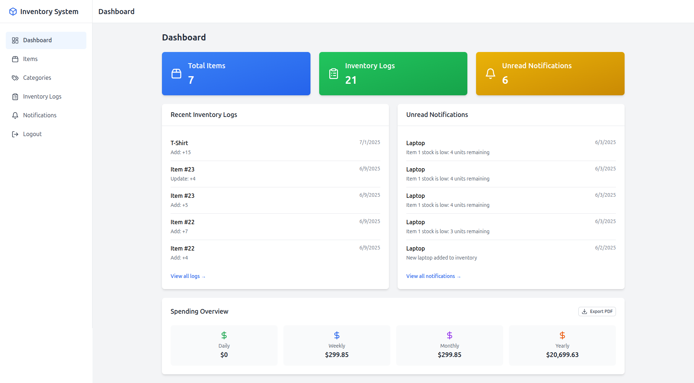
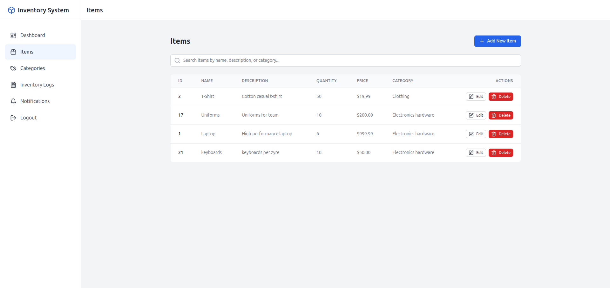
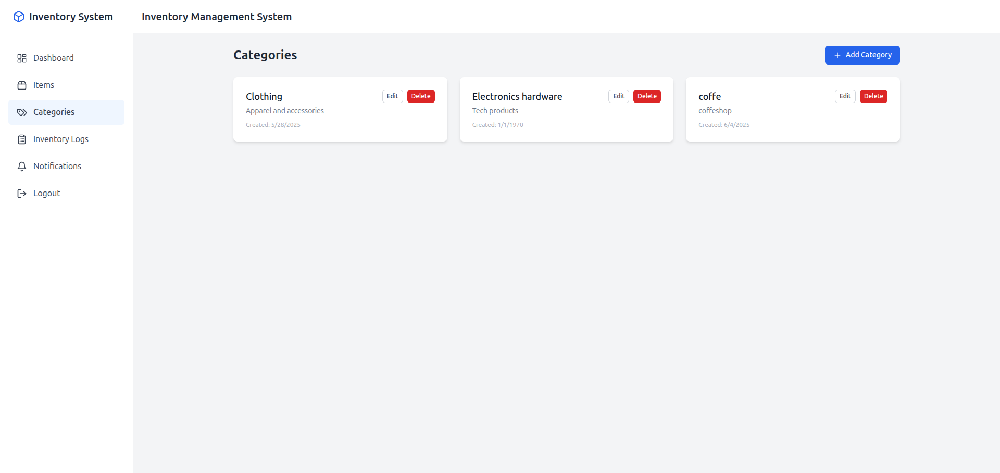
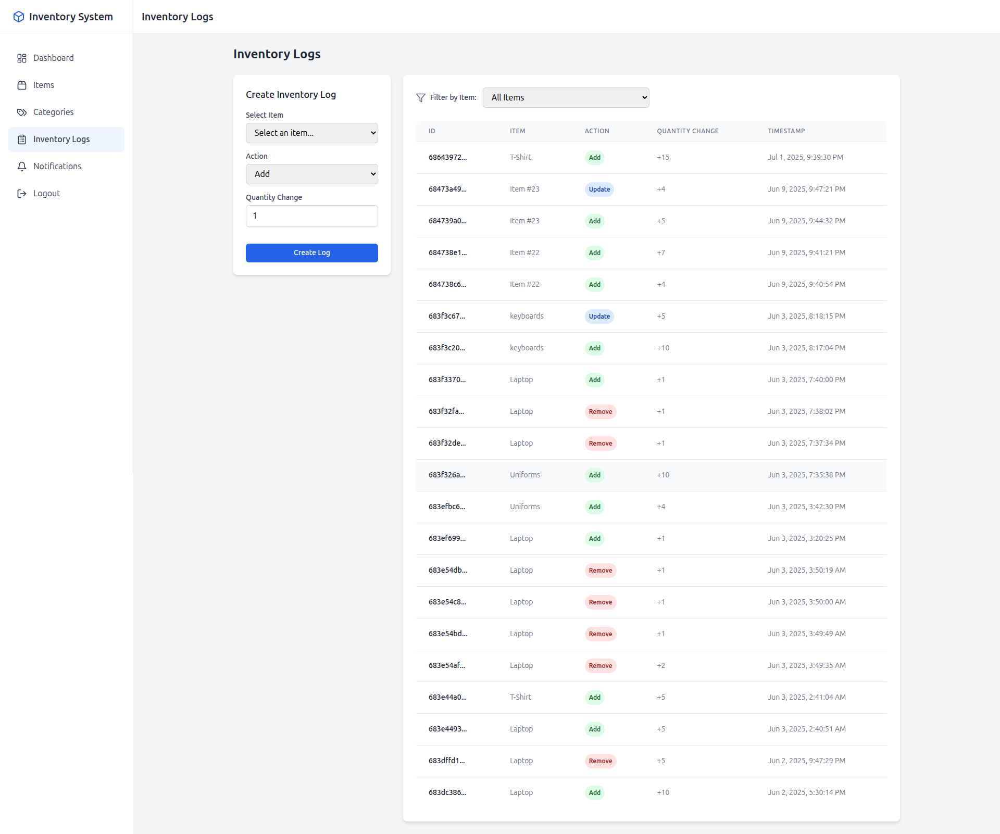
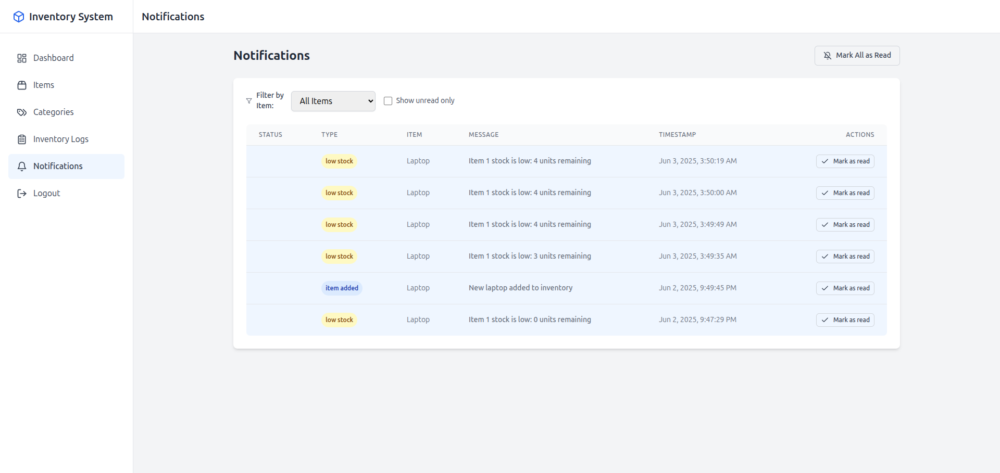

# Inventory Management System

## Purpose
The **Inventory Management System** is a full-stack web application designed to help small businesses efficiently manage their inventory. It provides a user-friendly interface to track items, categories, suppliers, inventory changes, and notifications, ensuring streamlined operations and real-time insights.

## Features
- **User Authentication**: Register and login with email and password.
- **Items Management**: Create, read, update, and delete (CRUD) items with name, quantity, and category.
- **Categories Management**: CRUD operations for categories with name and description.
- **Inventory Logs**: Track item stock changes (add, remove, update) with timestamps.
- **Suppliers**: Manage supplier details and associate them with items.
- **Notifications**: Automatic alerts for low stock (below 5 units).
- **Dashboard**: View total items, recent logs, unread notifications, and spending analytics with PDF export.

## Tech Stack
- **Frontend**:
    - React 18, TypeScript
    - Zustand (state management)
    - Tailwind CSS (styling)
    - Axios (API requests)
    - React Router (navigation)
    - React Toastify (notifications)
    - Lucide React (icons)
- **Backend**:
    - Node.js, Express
    - PostgreSQL with `pg` (database)
    - JWT (authentication)
    - Bcrypt (password hashing)
- **Tools**:
    - Vite (frontend build)
    - Postman (API testing)
    - WebStorm (IDE)
    - Ubuntu (development OS)

## Screenshots
Below are key visuals of the Inventory Management System:

- **Dashboard**: 
- **Items Management**: 
- **Categories Management**: 
-  **Inventory Logs**: 
- **Notifications**: 